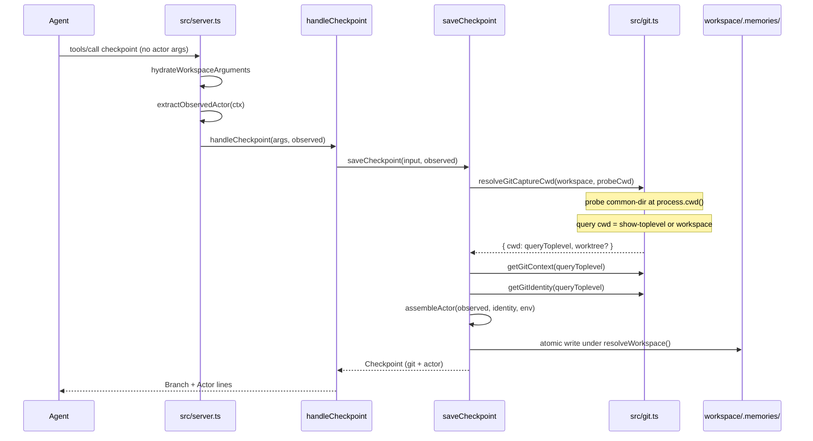

# Checkpoint actor identity and worktree-accurate git capture

**Date:** 2026-08-19
**Author:** Goldfish maintainers
**Status:** Draft
**Scope:** G1 (actor identity) + G2 (worktree-accurate git) from the 2026-08-18 audit-trail gap assessment
**Risk:** Medium (G2 path comparison on Windows and nested worktrees; CI is Ubuntu-only)

## Overview

Goldfish already records what changed, why, and when. It does not record which harness, model, or human produced a checkpoint, and a live worktree save can stamp the registered main checkout's branch and commit. That is an audit-trail gap (G1) plus a correctness bug (G2).

This design adds a nested, server-observed `actor` block to checkpoint frontmatter, and captures git from the caller's working tree when that tree shares a git common dir with the resolved workspace. Git *queries* run at the tree's `--show-toplevel`, not at `process.cwd()`. Memories still write to the resolved workspace `.memories/`. No new MCP tools, no actor tool arguments, no feature flags.

## Background & Motivation

Verified against a live checkpoint on 2026-08-19 (`docs/plans/2026-08-18-audit-trail-gap-assessment.md`):

- A checkpoint file already carries `id`, UTC `timestamp`, structured markdown, `git.branch` / `git.commit` / `git.files`, and optional typed fields. **What / why / when** are covered.
- **Who** is missing. Nothing records harness, model, session, OS user, or git identity. The human is only implied later by the commit author.
- **Where** can be wrong. A checkpoint saved from git worktree branch `worktree-ct-sidecar-migration` recorded `git.branch: main` with the main checkout's commit. `hydrateWorkspaceArguments` in `src/server.ts` recovered the registered project root, and `saveCheckpoint` in `src/checkpoints.ts` (~line 386) called `getGitContext(projectPath)` on that root.

The live bug is mechanical:

1. Plugin or worktree cwd is not the registered project root.
2. `hydrateWorkspaceArguments` replaces cwd with the recovered workspace path (correct for where files should land).
3. `saveCheckpoint` uses that same path for git capture (incorrect for which branch/commit/files were live).

Always using `process.cwd()` as the git *query* directory is also wrong:

- A plugin-hosted Goldfish server's cwd is the Goldfish install, a different git repo.
- Agents often run with cwd `src/` inside the same checkout. `getGitContext` runs `diff --name-only`, `diff --cached --name-only`, and `ls-files --others` in the given cwd (`src/git.ts:45-54`). From a subdirectory those commands emit cwd-relative paths. Today `saveCheckpoint` always queries `projectPath`, so stored `git.files` are repo-root relative. Recall `file:` matching is a path-suffix check on those stored paths (`src/recall.ts:189-200`). Querying `process.cwd()` after a common-dir match would change file paths for the common non-worktree case.

The live bug is worktree vs registered main, not subdirectory vs root. Probe with caller cwd; query git at that cwd's `--show-toplevel`.

G3 (`goldfish verify`), G4 integrity-beyond-git, G5 review-evidence records, and G6 secret hygiene are out of scope.

## Goals & Non-Goals

### Goals

- Record server-observed actor identity on new checkpoints, best-effort, never from tool args.
- Capture git from the caller's working tree when it is the same repository as the resolved workspace.
- Run branch / commit / files / `git config` at the caller's `--show-toplevel`, not at `process.cwd()`.
- Record `git.worktree` only when that toplevel differs from the workspace path.
- Keep writing checkpoint files under the resolved workspace `.memories/`.
- Keep old files parseable. Additive optional fields only.
- Keep compact recall cheap: omit `actor` unless `full: true`. Omit `git.worktree` from compact recall even when `file` keeps `git.files`, by copying git onto a new object (do not mutate the day-cache).
- Never fail a checkpoint save because actor or worktree detection failed.

### Non-Goals

- Briefs do not gain an actor block.
- No `goldfish verify` (G3). No new MCP tools.
- No actor parameters on the checkpoint tool schema.
- No new `src/actor.ts` module.
- No Orama schema change. Do not index `actor` or `git.worktree`. Search stays description / tags / branch / files / symbols (`src/ranking.ts` `toSearchDocument` today maps `checkpoint.git?.branch` and `git.files` only).
- No feature flags. No version bump in this work (changelog Unreleased only).
- No migration of existing checkpoints. Missing `actor` / `git.worktree` stays valid.
- Do not delete user files. Do not dump env. Do not write secrets.

## Key Decisions

These are user-approved. Do not reopen them during implementation. Items 8 and 13 include implementation refinements that still match the approved product rules.

1. **Actor is server-observed only.** Nested `actor` block with `harness`, `model`, `session`, `user`, `git_user`, `git_email`. Omit any field that cannot be observed. Omit the whole block if every field is empty.
2. **No actor tool args.** Extra keys an agent stuffs into the tool call are ignored. `CheckpointArgs` does not gain actor fields.
3. **Env beats MCP.** `GOLDFISH_HARNESS` > MCP client name. `GOLDFISH_SESSION` > MCP session id. `GOLDFISH_MODEL` has no MCP equivalent (omit if unset).
4. **`user` is OS username** via `os.userInfo().username`. `git_user` / `git_email` come from `git config user.name` / `user.email` in the git *query* cwd (the chosen toplevel or workspace path).
5. **MCP session.** Read `ctx.sessionId` in `src/server.ts`. Omit if missing or equal to `DEFAULT_SESSION_KEY` (`'default'`).
6. **MCP client name.** Per-request, extracted only in `src/server.ts`. SDK v2 deprecates `Server.getClientVersion()`; 2026-07-28 identity lives on `ctx.mcpReq.envelope`; 2025-era keeps initialize-scoped `getClientVersion()`. `Implementation` has a `name`. Public envelope type is opaque (`RequestMetaEnvelope = {}`). Inspect `CLIENT_INFO_META_KEY` / envelope at implementation time and **pin the winning probe with a modern-era test before merge**. If the name is absent, omit `harness`.
7. **Protocol boundary.** `src/server.ts` is the only module allowed to inspect MCP request context or protocol-era metadata. Extract `{ harness?: string; session?: string }` and pass it as an extra argument to `handleCheckpoint`, not via `CheckpointArgs`.
8. **G2 capture cwd (product rule, query-cwd refinement).** Probe `--git-common-dir` from `process.cwd()` (or injected caller cwd) and from the resolved workspace. When those common dirs match, run branch / commit / files / `git config` at the caller's `--show-toplevel`. When they do not match, or either lookup fails, run git at the workspace path (today's behavior). Do not run file/branch/commit queries in `process.cwd()` itself.
9. **`git.worktree`.** When that query toplevel differs from the workspace path, set `git.worktree` to the absolute toplevel. Omit when they are the same. Compare with `realpath` when possible, else `normalizePathKeyForSafetyCheck` in `src/workspace.ts`. The absolute path is an approved product decision; see Security for the committed-host-path consequence.
10. **Storage location does not change.** `saveCheckpoint` still uses `resolveWorkspace(input.workspace)` for `.memories/`.
11. **Best-effort.** Detection failure never fails the save.
12. **Tool description.** Do not add actor parameters. The checkpoint tool description is 1379 characters today (`src/tools.ts`). Extend the existing auto-capture sentence with `and observed actor identity` (fits the 2,000-character cap with hundreds of characters of headroom). No extra behavioral paragraph; agents do not pass actor.
13. **Compact vs full recall.** Compact omits `actor`. `full: true` includes it like other metadata. Handler save response prints one labeled `Actor:` line when present. Existing `Branch:` line shows the captured (worktree-accurate) branch; prove the branch on `saveCheckpoint`'s return value in commit 1, not with a handler test. `git.worktree` prints only in full recall. Compact+file copies `branch`/`commit`/`files` onto a new object and does not mutate the cached git.

## Architecture Quality

### Affected modules

| Area | Change | Boundary |
|---|---|---|
| `src/types.ts` | `GitContext.worktree?`, `Actor`, `ObservedActor`, `Checkpoint.actor?` | Types only |
| `src/git.ts` | `resolveGitCaptureCwd`, `getGitIdentity`; `runGit` stays private | Git capture only |
| `src/checkpoints.ts` | Assemble actor; `formatActorLine`; format/parse/save optional `actor` and `git.worktree`; query git at resolved toplevel | Storage |
| `src/handlers/checkpoint.ts` | Extra `observed?: ObservedActor` arg; ignore stuffed actor keys; print `formatActorLine` | Handler |
| `src/handlers/recall.ts` | Full-mode `Actor:` via `formatActorLine`; `git.worktree` on the Git line when present | Presentation |
| `src/recall.ts` | Strip `actor` when `full` is false; compact+file copies git without `worktree` (new object, no cache mutation) | Compact recall |
| `src/ranking.ts` | No change. Do not index `actor` or `git.worktree` | Search |
| `src/server.ts` | Extract MCP harness/session; pass to `handleCheckpoint` | Protocol adapter only |
| `src/tools.ts` | Auto-capture sentence only; no schema properties | 2k cap (currently 1379) |
| `tests/preload.ts` | Clear `GOLDFISH_HARNESS` / `GOLDFISH_MODEL` / `GOLDFISH_SESSION` | Host isolation |
| Tests | git, checkpoints, handlers, server, recall, protocol-compatibility, test-isolation | Acceptance |

No new `src/actor.ts`. No new MCP tool.

### Caller-facing interface

- Checkpoint tool schema does not change.
- New fields appear in saved markdown and in the save response.
- `handleCheckpoint(args, observed?: ObservedActor)` gains an extra non-schema parameter.
- `saveCheckpoint(input, observed?: ObservedActor)` gains the same extra parameter so storage tests do not go through MCP.

### Depth / locality

- Identity capture stays on the save path.
- MCP ctx inspection stays in `src/server.ts`.
- Git cwd resolution stays in `src/git.ts`.
- Actor assembly and `formatActorLine` stay in `src/checkpoints.ts` (small functions there, not a new module).
- Reuse `CheckpointDependencies` if tests need injection (`getCallerCwd`, `getOsUsername`, `getGitIdentity`). Do not add a parallel test-hook mechanism.

### Test surface

- `saveCheckpoint` / `formatCheckpoint` + `parseCheckpointFile` round-trip for `actor` and `git.worktree`, including a worktree-only git fixture.
- Git capture helper: real worktree, nested worktree, subdirectory of the same checkout, different-repo cwd, common-dir failure, mixed-separator path keys.
- Handler ignores stuffed actor keys and prints a labeled `Actor:` line.
- Server forwards observed session/client name on **both** protocol eras; env overrides MCP; `'default'` session is omitted.
- Preload isolation: inherited `GOLDFISH_*` does not leak into unrelated saves.

### Seams / adapters

```ts
export interface ObservedActor {
  harness?: string;
  session?: string;
}

export async function resolveGitCaptureCwd(
  workspacePath: string,
  callerCwd?: string
): Promise<{ cwd: string; worktree?: string }>
```

`cwd` in that result is the git **query** directory: the caller's `--show-toplevel` on a common-dir match, otherwise `workspacePath`. It is not `process.cwd()`.

`saveCheckpoint` uses `resolveGitCaptureCwd`, then `getGitContext(resolved.cwd)` and `getGitIdentity(resolved.cwd)`, then attaches `worktree` onto `GitContext` when present.

```ts
export function formatActorLine(actor: Actor): string | undefined
```

Returns `undefined` when every field is empty. Both handlers use this helper. Do not duplicate the string in `src/handlers/`.

### Rejected shortcuts

- **New actor module.** One nested YAML block does not justify a fourth package boundary.
- **Actor as tool args.** Agents would invent identity; the audit record would be untrusted.
- **Always `process.cwd()` as git query cwd.** Plugin-hosted server cwd is the Goldfish install, a different repo. That would stamp the wrong git onto project checkpoints.
- **Common-dir match → query git at `process.cwd()`.** Fixes worktrees but makes `git.files` subdirectory-relative when cwd is `src/`. Probe with caller cwd; query at `--show-toplevel`.
- **`getClientVersion()` only, relying on SDK backfill for 2026-07-28.** Simpler, one accessor, and the SDK says 2026-07-28 instances are backfilled from the envelope. Rejected as the *only* path: the accessor is deprecated, a backfill regression would silently drop harness on current Claude Code / Codex, and the architecture rule is envelope-first on the modern era. Use envelope inspection in `src/server.ts`, with `getClientVersion()` as the 2025-era fallback. Pin both with tests.

### Architecture risk

Medium — G2 path comparison and worktree detection on Windows and nested worktrees. CI is `ubuntu-latest` only (`.github/workflows/ci.yml`). Ubuntu `git worktree add` does **not** cover Git-for-Windows common-dir strings.

Mitigation: tests that create a real git worktree (sibling and nested) on Linux; a mixed-separator path-key unit test as the Windows stand-in, reusing `normalizePathKeyForSafetyCheck` (`src/workspace.ts:165`) after `realpath` when possible, matching `src/workspace-recovery.ts` (`tryRealpath` + `comparablePathKey`). Do not invent a third path-equality helper with different slash/case rules.

## Proposed Design

### Save-path data flow



Workspace recovery still decides **where files go**. Git query cwd decides **which git metadata is recorded**. Those two answers are allowed to differ.

### G2: capture cwd

Today (`src/checkpoints.ts` ~386):

```ts
const projectPath = resolveWorkspace(input.workspace);
const gitContext = await checkpointDependencies.getGitContext(projectPath);
```

Keep capture at the current `getGitContext` site (`src/checkpoints.ts:386`). The checkpoint object is created at line 391; git is attached at lines 412-414. Do not assign `checkpoint.git` next to the capture call — that paste does not compile.

At line 386, replace only the `getGitContext(projectPath)` call:

```ts
const callerCwd = checkpointDependencies.getCallerCwd?.() ?? process.cwd();
let capture = { cwd: projectPath, worktree: undefined as string | undefined };
try {
  capture = await resolveGitCaptureCwd(projectPath, callerCwd);
} catch {
  capture = { cwd: projectPath, worktree: undefined };
}
const gitContext = await checkpointDependencies.getGitContext(capture.cwd);
if (capture.worktree) gitContext.worktree = capture.worktree;
```

This first try/catch is **only** for `resolveGitCaptureCwd`. On throw, query git at `projectPath` and do not set `worktree`. Then `getGitContext(capture.cwd)` runs as today.

After the checkpoint object exists, change **only** the attach condition at lines 412-414:

```ts
if (gitContext.branch || gitContext.commit || gitContext.files || gitContext.worktree) {
  checkpoint.git = gitContext;
}
```

Attach `checkpoint.git` when **any** of `branch`, `commit`, `files`, or `worktree` is present. Today's condition omits `worktree`, so a capture that yields only `worktree` would drop the field. Round-trip a fixture that has only `git.worktree`.

`resolveGitCaptureCwd` algorithm:

1. Default `probeCwd` to `process.cwd()` (injectable via `getCallerCwd`).
2. Resolve `--git-common-dir` in `probeCwd` and in `workspacePath` via existing private `runGit`. If either command fails (nonzero, throw, empty), return `{ cwd: workspacePath }`.
3. Make each common-dir absolute (`path.isAbsolute` / `path.join` with the command cwd). Canonicalize with `realpath`; on failure use `normalizePathKeyForSafetyCheck`. If the keys differ, return `{ cwd: workspacePath }`.
4. If they match, resolve `--show-toplevel` from `probeCwd`. If that fails, return `{ cwd: workspacePath }`.
5. Query cwd is that absolute toplevel. If it differs from `workspacePath` under the same path compare, set `worktree` to the toplevel. Omit `worktree` when they are the same.
6. Return `{ cwd: toplevel, worktree? }`. Callers pass `cwd` to `getGitContext` and `getGitIdentity`. They never pass `probeCwd` / `process.cwd()` into those functions.

Git for Windows may return mixed slashes or a relative common-dir (`.git`, `../main/.git`). Always join relative results onto the command cwd before compare.

`getGitContext` already accepts `cwd` (`src/git.ts:45`) and tests already cover the optional cwd (`tests/git.test.ts` "uses optional cwd parameter instead of process.cwd()"). Do not change its file/branch/commit queries. The G2 change is which cwd `saveCheckpoint` passes in.

When query cwd differs from the workspace path, log one info line through `getLogger()` and continue:

```
git.capture cwd=/path/to/worktree workspace=/path/to/main
```

Do not log when they are the same. Do not log git identity or env. `cwd` in that line is the query toplevel, not the probe subdirectory.

#### Worked cases

| Case | Probe cwd | Git query cwd | `git.worktree` | Files land |
|---|---|---|---|---|
| Same-repo sibling worktree, workspace recovered to main | worktree path (or a subdir of it) | worktree `--show-toplevel` | worktree toplevel | `main/.memories/` |
| Nested worktree under main (`git worktree add ./wt`) | worktree path | worktree toplevel | worktree toplevel | `main/.memories/` |
| Subdirectory of the same checkout (`main/src`, workspace `main`) | `main/src` | `main` (toplevel) | omitted (toplevel == workspace) | `main/.memories/`; `git.files` stay repo-root relative |
| Plugin install cwd is a different git repo | Goldfish install | workspace path | omitted | workspace `.memories/` |
| cwd is not a git repo | non-git dir | workspace path | omitted | workspace `.memories/` |
| common-dir lookup fails | anything | workspace path | omitted | workspace `.memories/` |

The current test `passes workspace path to getGitContext` (`tests/checkpoints.test.ts` ~1085) stays valid for temp workspaces that are not the same git repo as `process.cwd()`. After G2 it still expects `getGitContext` to receive the workspace path in that case.

Required new test: cwd `main/src`, workspace `main` → `getGitContext` receives `main` (or a realpath-equal path), `git.files` are root-relative (`src/foo.ts` not `foo.ts`), `git.worktree` omitted, memories under `main/.memories/`.

### G1: actor assembly

`src/server.ts` extracts MCP-observed identity only. Env, OS user, and git config stay out of the protocol adapter.

```ts
function extractObservedActor(
  ctx: { sessionId?: string; mcpReq: { envelope?: unknown } },
  server: Server
): ObservedActor | undefined {
  const observed: ObservedActor = {};
  const harness = readMcpClientName(ctx, server);
  const session = ctx.sessionId;
  if (harness) observed.harness = harness;
  if (session && session !== DEFAULT_SESSION_KEY) observed.session = session;
  return observed.harness || observed.session ? observed : undefined;
}
```

`readMcpClientName` — two era paths, both required:

1. **Modern 2026-07-28.** `ctx.mcpReq.envelope` is a non-null object (existing roots code already uses `envelope === undefined` as the 2025-era signal at `src/server.ts:209`). Look up `CLIENT_INFO_META_KEY` from `@modelcontextprotocol/server`. Read `.name` if it is a non-empty string. Envelope public type is `RequestMetaEnvelope = {}`; treat the object as `Record<string, unknown>` and probe at implementation time. Pin the winning slot in `tests/protocol-compatibility.test.ts` against the existing spawned `serveStdio` client (`Client({ name: 'goldfish-modern-test-client' })` in `connectModernServer`). That pin is a merge gate, not an open question.
2. **Legacy 2025-era.** Envelope is missing. Call `server.getClientVersion()?.name`. Pin with the existing in-process `InMemoryTransport` helper (`versionNegotiation: { mode: 'legacy' }`, `Client({ name: 'goldfish-test-client' })` in `tests/server.test.ts`). InMemoryTransport is legacy-only; it cannot pin the envelope path.

If the name is absent or blank, omit `harness`. Do not pass `ctx` into handlers. `createServer`'s `tools/call` handler already has the `Server` instance in closure (`src/server.ts:175`).

There is no supported in-process modern transport in this repo. The modern harness test **must** use the spawned `serveStdio` path in `tests/protocol-compatibility.test.ts` (temporary cwd, isolated `GOLDFISH_HOME`, explicit workspace). Do not add an in-process HTTP test.

`assembleActor` lives in `src/checkpoints.ts`:

| Field | First non-empty wins |
|---|---|
| `harness` | `process.env.GOLDFISH_HARNESS`, then `observed.harness` |
| `model` | `process.env.GOLDFISH_MODEL` only |
| `session` | `process.env.GOLDFISH_SESSION`, then `observed.session` if not `'default'` |
| `user` | `os.userInfo().username` (try/catch; omit on throw or empty) |
| `git_user` | `git config user.name` in **query** cwd |
| `git_email` | `git config user.email` in **query** cwd |

Treat whitespace-only strings as empty. After env override, if the winning `session` equals `'default'`, omit it.

Add `getGitIdentity(cwd?: string)` in `src/git.ts` using private `runGit(['config', 'user.name'], cwd)` and `user.email`. Return `{}` on failure. Do not put identity onto `GitContext`.

If every assembled field is empty, leave `checkpoint.actor` undefined so `formatCheckpoint` omits the block.

Use **two** try/catch blocks at the save site. Do not wrap resolve and assemble in one catch.

1. **Resolve** (at the current `getGitContext` site, before `checkpoint` exists). `resolveGitCaptureCwd` throw → `capture = { cwd: projectPath }`, then `getGitContext(projectPath)`, no `git.worktree`. The checkpoint still saves.
2. **Assemble** (after `checkpoint.git` is attached). `assembleActor` / `getGitIdentity` / `os.userInfo` throw → omit `actor`, **keep** the git already captured. A `user` or `git config` throw must not re-query the registered root and stamp `main`.

```ts
try {
  const actor = assembleActor(observed, identity, process.env);
  if (actor) checkpoint.actor = actor;
} catch {
  // omit actor; checkpoint.git is already set
}
```

Named tests: `saveCheckpoint does not throw when resolveGitCaptureCwd throws` (no worktree; workspace git or empty git). `saveCheckpoint does not throw when actor assembly throws` **and still records worktree git** when capture cwd was a worktree.

### Format and parse

`formatCheckpoint` already emits only present git keys (`src/checkpoints.ts:111-121`). Add:

```ts
if (checkpoint.git.worktree) git.worktree = checkpoint.git.worktree;
```

Keep `actor` immediately after `git` so the audit block is contiguous:

```ts
if (checkpoint.actor) {
  const actor: Record<string, string> = {};
  for (const key of ['harness', 'model', 'session', 'user', 'git_user', 'git_email'] as const) {
    const value = checkpoint.actor[key];
    if (value) actor[key] = value;
  }
  if (Object.keys(actor).length > 0) frontmatter.actor = actor;
}
```

Example markdown (README / `docs/IMPLEMENTATION.md` must show the same shape, including that `git.worktree` is a machine-local absolute path):

```markdown
---
id: checkpoint_a1b2c3d4
timestamp: 2026-08-19T15:04:05.000Z
git:
  branch: worktree-ct-sidecar-migration
  commit: abc1234
  worktree: /home/murphy/source/goldfish/.worktrees/example
  files:
    - src/checkpoints.ts
actor:
  harness: claude-code
  model: claude-opus-4
  session: 7f3a2c
  user: murphy
  git_user: Murphy
  git_email: murphy@example.com
summary: Worktree-accurate git plus observed actor
---

## WHAT
...
```

`normalizeGit` (`src/checkpoints.ts:226`) must copy `worktree` when present. `parseCheckpointFile` already goes through `normalizeGit`. Add `normalizeActor` with the same omit-empty rules and attach `checkpoint.actor` only when at least one field survives. Unknown actor keys are dropped. `parseJsonCheckpoint` uses the same helpers so the two parsers do not disagree.

Old files without `actor` / `git.worktree` keep parsing. No backfill.

A fixture with **only** `git.worktree` (no branch/commit/files) must format, parse, and survive `saveCheckpoint`'s attach condition.

### Handler response

`src/handlers/checkpoint.ts` already prints:

```
Branch: ${branch} @ ${commit}
```

That line stays and needs **no commit-1 edit**. After G2 it shows the worktree branch/commit because `checkpoint.git` is captured from the worktree toplevel. Prove that on `saveCheckpoint`'s returned `git.branch`, not with a handler test (commit 1 does not touch `src/handlers/checkpoint.ts` or `tests/handlers.test.ts`). Do not add a `Worktree:` line to the save response (token cost; full recall can show the path).

When `checkpoint.actor` is present, print one `Actor:` line after `Branch:` (or after `Time:` if there is no git). Shared helper `formatActorLine` in `src/checkpoints.ts`:

```
Actor: harness={harness} model={model} session={session} user={user} git_user={git_user} git_email={git_email}
```

Rules:

- Every present field is `key=value`. No unlabeled tokens (`Actor: claude-opus-4` is ambiguous).
- Omit a pair entirely when that field is empty. Do not print `harness=` with a blank value.
- `git_user` and `git_email` are independent: print `git_user=Murphy` without email; print `git_email=murphy@example.com` without user; print both when both exist; print neither when both are missing.
- Join with single spaces. Prefix `Actor: `.
- Return `undefined` when no fields remain (callers skip the line).

Examples:

- `Actor: harness=claude-code model=claude-opus-4 session=7f3a2c user=murphy git_user=Murphy git_email=murphy@example.com`
- `Actor: user=murphy`
- `Actor: git_email=murphy@example.com`

Stuffed keys such as `args.actor` or `args.harness` are not read. `handleCheckpoint` continues to destructure only `CheckpointArgs` fields.

### Recall

Live compact vs full display is `presentCheckpoint` (`src/recall.ts:473`) then `src/handlers/recall.ts` `formatCheckpoint` (~112) for **both** modes. `buildRetrievalDigest` is not on the live recall path.

`presentCheckpoint` currently strips `git` unless `file` is set (`tests/recall.test.ts` "retains git.files in compact file-filtered recall"). The `git` value in that destructure is the **same object** stored in the per-day cache (`src/checkpoints.ts` day cache, then `src/recall.ts` ~546). Today the function does not mutate `git`. Compact+file must drop `worktree` **without** writing back to that cached object.

```ts
if (!options.full) {
  const {
    git,
    actor,
    symbols,
    context, decision, alternatives, evidence,
    impact, unknowns, confidence,
    ...minimal
  } = withDescription;
  return {
    ...minimal,
    ...(minimal.next ? { next: truncate(minimal.next, MAX_DEFAULT_NEXT_LENGTH) } : {}),
    ...(options.file && git ? {
      git: {
        ...(git.branch ? { branch: git.branch } : {}),
        ...(git.commit ? { commit: git.commit } : {}),
        ...(git.files ? { files: git.files } : {})
      }
    } : {}),
    ...(options.symbol && symbols ? { symbols } : {})
  };
}
```

Rules:

- Always strip `actor` when `!options.full` (destructure it out; do not put it on the compact result).
- When `!options.full` and `file` retains git, **copy** `branch` / `commit` / `files` onto a **new** object. Do not `delete git.worktree`. Do not spread `{ ...git }` and then delete `worktree` on that copy if the spread still aliases nested arrays only — the `worktree` string itself must not be copied. The original cached `git` object stays untouched.
- Full mode keeps `actor` and `git.worktree` on the original checkpoint.

Named test: `compact file-filtered recall then full recall in the same process still has git.worktree`. Compact+file must not print a host path, and a later `full: true` recall of the same file must still show `worktree`.

`src/handlers/recall.ts` `formatCheckpoint`:

- Append `, worktree: ${path}` to the existing Git line when `checkpoint.git.worktree` is set (after the strip, this is full mode only).
- Print `formatActorLine(checkpoint.actor)` when actor is present (full mode only, because compact stripped it).

Do not index `actor` or `git.worktree` in `toSearchDocument` (`src/ranking.ts:80-97`). Search stays description / tags / branch / files / symbols. Do not later map every `GitContext` key into the search document.

### Tool schema and description

`CheckpointArgs` (`src/types.ts:161`) and `getTools()` inputSchema (`src/tools.ts`) do not gain actor properties.

The checkpoint tool description is **1379 characters** today. Commit 2 changes the auto-capture sentence to:

```
Automatically captures git context (branch, commit, changed files), timestamp (UTC), tags, and observed actor identity.
```

That addition is well under the 2,000-character cap enforced by `tests/server.test.ts`. Do not add "pass harness/model" guidance.

### Test isolation

`tests/preload.ts` currently sets only `GOLDFISH_HOME`. After this work it must also **delete** `GOLDFISH_HARNESS`, `GOLDFISH_MODEL`, and `GOLDFISH_SESSION` before any test file loads (same contract as `GOLDFISH_HOME`: the suite must not inherit a developer’s shell). Extend `tests/test-isolation.test.ts` to assert those three names are unset.

Existing `beforeEach` stubs in `tests/checkpoints.test.ts`, `tests/handlers.test.ts`, `tests/recall.test.ts`, and `tests/server.test.ts` set only `getGitContext`. Default them to host-independent identity as well:

```ts
restoreCheckpointDependencies = __setCheckpointDependenciesForTests({
  getGitContext: () => ({ branch: 'main', commit: 'abc1234' }),
  getOsUsername: () => undefined,
  getGitIdentity: async () => ({})
});
```

Named tests that this isolation must make true:

- `saveCheckpoint omits actor when env, OS user, and git identity are empty`
- `inherited GOLDFISH_HARNESS does not leak into an unrelated save` (preload already cleared it; the test sets the var, saves in a nested describe with restore, and a later save in the default stub has no harness)

G2 real-git tests **must restore the real `getGitContext`**. `__setCheckpointDependenciesForTests` merges overrides (`src/checkpoints.ts:30-37`). Adding only `getCallerCwd` on top of the file-level stub keeps the fake `{ branch: 'main' }` and never exercises worktree git. Pattern:

```ts
const restore = __setCheckpointDependenciesForTests({
  getGitContext, // real export from src/git.ts
  getCallerCwd: () => worktreePath
});
```

or assign the previous dependencies back to defaults for that test. Do not merge `getCallerCwd` onto the stub and call it a worktree test.

Tests that set `GOLDFISH_*` themselves restore in `afterEach`. Worktree fixtures live in `tmpdir()`; `afterEach` runs `git worktree remove` / `rm`.

## API / Interface Changes

### Before

```ts
export async function handleCheckpoint(args: CheckpointArgs)
export async function saveCheckpoint(input: CheckpointInput): Promise<Checkpoint>
export async function getGitContext(cwd?: string): Promise<GitContext>

export interface GitContext {
  branch?: string;
  commit?: string;
  files?: string[];
}
```

`src/server.ts` tools/call:

```ts
case 'checkpoint':
  result = await handleCheckpoint(hydratedArgs as unknown as CheckpointArgs);
```

### After

```ts
export interface ObservedActor {
  harness?: string;
  session?: string;
}

export interface Actor {
  harness?: string;
  model?: string;
  session?: string;
  user?: string;
  git_user?: string;
  git_email?: string;
}

export interface GitContext {
  branch?: string;
  commit?: string;
  files?: string[];
  worktree?: string; // absolute toplevel when it differs from workspace
}

export interface Checkpoint {
  // existing fields...
  git?: GitContext;
  actor?: Actor;
}

export async function handleCheckpoint(
  args: CheckpointArgs,
  observed?: ObservedActor
)

export async function saveCheckpoint(
  input: CheckpointInput,
  observed?: ObservedActor
): Promise<Checkpoint>

export async function resolveGitCaptureCwd(
  workspacePath: string,
  callerCwd?: string
): Promise<{ cwd: string; worktree?: string }>

export async function getGitIdentity(
  cwd?: string
): Promise<{ name?: string; email?: string }>

export function formatActorLine(actor: Actor): string | undefined
```

Export `DEFAULT_SESSION_KEY` from `src/server.ts` (currently an unexported `const`) so tests and the extractor share the same `'default'` sentinel.

`CheckpointArgs` is unchanged. `CheckpointInput` is unchanged. Observed identity is not a storage-input field.

## Data Model Changes

Additive optional YAML only. No migration. Markdown in `.memories/` remains the source of truth.

| Field | Type | Write | Read of old files |
|---|---|---|---|
| `git.worktree` | string (absolute **host** path) | when query toplevel ≠ workspace | absent → undefined |
| `actor.harness` | string | env or MCP client name | absent → no actor field |
| `actor.model` | string | `GOLDFISH_MODEL` | absent |
| `actor.session` | string | env or MCP session, never `'default'` | absent |
| `actor.user` | string | OS username | absent |
| `actor.git_user` | string | `git config user.name` | absent |
| `actor.git_email` | string | `git config user.email` | absent |

UTC timestamps, atomic write-then-rename, and date-dir file locking are unchanged (`src/checkpoints.ts` `withLock` + `writeFile`/`rename`).

Storage estimate: one extra YAML mapping, typically < 400 bytes per new checkpoint. No new files, no derived index.

## Alternatives Considered

### 1. Actor fields as checkpoint tool arguments

Agents would pass harness/model/session in the tool call.

- **For:** Trivial to implement; no MCP ctx inspection.
- **Against:** The audit record would be whatever the model claimed. The assessment requires identity that is "populated automatically, never trusted from free text." Extra schema keys also spend the 2,000-character tool-description budget. **Rejected.**

### 2. Always capture git from `process.cwd()` (query cwd = probe cwd)

Would fix the worktree case where cwd is the worktree root.

- **For:** One-line change; no common-dir compare.
- **Against:** Plugin-hosted Goldfish cwd is the install checkout, a different repo. Checkpoints would record Goldfish's branch/commit/files, not the project's. The assessment's rejected-shortcuts list names this. **Rejected.**

### 3. Common-dir match → query git at `process.cwd()`

The first G2 draft. Matches the approved "same-repo worktree vs other repo" product split.

- **For:** Records the worktree branch when cwd is the worktree.
- **Against:** `getGitContext` file commands are cwd-relative. Agents in `src/` would store `foo.ts` instead of `src/foo.ts`, breaking recall `file:` suffix matching. The live bug is worktree vs main, not subdirectory vs root. **Rejected.** Probe at cwd; query at `--show-toplevel`.

### 4. `getClientVersion()` only, trust SDK envelope backfill

SDK docs say 2026-07-28 instances are backfilled from the envelope, so one accessor could cover both eras.

- **For:** No opaque `RequestMetaEnvelope = {}` probe; less code in `src/server.ts`.
- **Against:** Deprecated; a backfill regression silently drops harness on current clients; architecture rule is envelope-first on 2026-07-28. **Rejected as the sole path.** Keep envelope inspection plus legacy `getClientVersion()` fallback. Pin both.

### 5. Split actor capture into `src/actor.ts`

- **For:** Isolated unit tests.
- **Against:** A six-field YAML block assembled on one save path. The approved architecture quality forbids a new module. Keep `assembleActor` and `formatActorLine` next to `formatCheckpoint`. **Rejected.**

### 6. Two PRs (G2 then G1) vs one PR

See PR Plan. Two PRs isolate the live bug, but both edit `formatCheckpoint` / `parseCheckpointFile` / `saveCheckpoint`. One PR with two commits is safer for this repo. **Preferred: single PR, G2 commit then G1 commit.**

## Security & Privacy Considerations

`.memories/` is committed. New fields are therefore public to anyone with repo access.

- Record only: harness name, model id, session id, OS username, git `user.name` / `user.email`, and (when the query toplevel differs from the workspace) an **absolute host path** in `git.worktree`.
- **`git.worktree` is a new committed host path.** Current git frontmatter is `branch` / `commit` / **relative** `files` only. `formatCheckpoint` does not write `filePath` (`src/checkpoints.ts:100-174`); that field is in-memory after save. Registry paths live in `~/.goldfish/registry.json`, not in project markdown. Do not compare `git.worktree` to `filePath` or registry `path`. Compare it to description text and `git.files`: those are already committed, but they are not machine-local absolute paths. Callers cloning the repo will see another developer's worktree filesystem path when that field is present. README and `docs/IMPLEMENTATION.md` must show an absolute `git.worktree` example so humans expect this. The product decision to record the absolute path stands.
- Do not dump `process.env`. Do not write home paths into `actor`. `user` is a username, not `os.userInfo().homedir`.
- Do not record tokens, API keys, or prompt contents.
- Stuffed actor keys on the tool call are ignored, so a model cannot overwrite server-observed identity through the schema.
- Capture is best-effort: a permission error on `os.userInfo` or git config omits the field; it does not fail the save and does not retry in a way that leaks.
- Compact recall strips `git.worktree` so the host path is not injected into default-token recall.

Threat model: a later reviewer reading committed markdown should see who (harness/model/user) produced the record, and which worktree produced it when that differs from the registered root. They should not see secrets that were never supposed to be in checkpoints (G6 remains a process rule, not a schema feature).

## Observability

Use the existing structured file logger (`src/logger.ts`). No new metrics system.

- One `info` line when git **query** cwd differs from the workspace path (`git.capture cwd=… workspace=…`).
- Existing `tool.call name=checkpoint duration=…ms` stays.
- Detection failures are silent at info level (best-effort). A `debug` line is optional and must not include env values.
- Logging must never throw; `createLogger` already swallows write errors.

No alerts. This is a local stdio server.

## Rollout Plan

Goldfish rollout is: land on a branch, tests, changelog Unreleased. Version bump is a later release decision.

- No feature flags.
- No migration.
- Additive fields: old readers ignore unknown YAML; new parser accepts missing fields.
- Rollback: revert the PR. If a full revert lands, unknown nested keys in YAML are unused by the old parser (`parseCheckpointFile` copies only known fields). Old Goldfish will ignore `actor` and `git.worktree` and still load the checkpoint. That is acceptable.
- Changelog: add an `## [Unreleased]` section. Commit 1: **Fixed** (worktree git stamped main). Commit 2: **Added** (actor block). Do not bump `SERVER_VERSION` / plugin manifests / README version banner in this work.

## Open Questions

None remaining as merge gates. Product decisions are closed.

The opaque envelope slot (`CLIENT_INFO_META_KEY` vs nested `clientInfo`) is an implementation-time probe, pinned by the modern spawned test in commit 2. After that test exists, the slot is not an open question.

## Risks

| Risk | Severity | Mitigation |
|---|---|---|
| Subdirectory cwd makes `git.files` relative (regression vs today) | High if missed | Query at `--show-toplevel`; named test `main/src` → root-relative files, no `git.worktree` |
| Windows path compare (`C:\` vs `c:/`, Git mixed slashes) | Medium | `realpath` then `normalizePathKeyForSafetyCheck`; mixed-separator unit test in commit 1 on Linux. CI is `ubuntu-latest` only — that test is the stand-in. Ubuntu `git worktree add` does not cover Git-for-Windows |
| Nested worktree (`git worktree add ./wt`) vs sibling worktree | Medium | Both shapes in `tests/git.test.ts` with real `git worktree add` |
| Plugin-hosted cwd is another git repo | High if missed | Explicit different-repo test: query cwd must be workspace, no `git.worktree` |
| SDK envelope opacity on 2026-07-28 | Medium until pinned | Envelope inspection in `src/server.ts`; legacy InMemoryTransport test **and** spawned modern stdio test; merge blocked until the modern test pins the slot |
| Host `GOLDFISH_*` / OS user leak into suite | High if missed | Clear env in `tests/preload.ts`; default `getOsUsername` / `getGitIdentity` stubs; isolation test |
| File-level `getGitContext` stub hides G2 | High if missed | Real-git tests restore the real `getGitContext` |
| `os.userInfo()` throws in some CI images | Low | try/catch; omit `user`; save still succeeds; default stub is undefined |
| Compact+file prints `git.worktree` | Low | Copy `branch`/`commit`/`files` onto a new git object in `presentCheckpoint`; never mutate the cached `git` |
| Compact+file `delete git.worktree` poisons the day cache | High if missed | Named test: compact+file then `full: true` in the same process still has `git.worktree` |
| One shared try/catch re-queries workspace git after a worktree capture when actor throws | High if missed | Two try/catch blocks; assemble throw keeps already-captured git |
| Extra git processes blow the 50ms save budget | Low | Common-dir + toplevel + identity are a handful of `runGit` calls; existing five-command `getGitContext` already dominates; parallelize identity with context after query cwd is known |

## Acceptance Criteria

Tick these during implementation. **Behavior tests** are named after observable failure. **Static checks** are grep/type assertions, not the first red tests.

### G2 git capture — behavior tests

- [ ] `resolveGitCaptureCwd uses the worktree toplevel when caller cwd is a same-repo worktree`
- [ ] `nested git worktree add inside the main tree records git.worktree and the worktree branch`
- [ ] `saveCheckpoint from a worktree writes under the main workspace .memories/ with the worktree branch`
- [ ] `caller cwd main/src with workspace main keeps root-relative git.files and omits git.worktree`
- [ ] `different-repo caller cwd uses the workspace path and omits git.worktree`
- [ ] `git-common-dir failure falls back to the workspace path`
- [ ] `mixed-separator path keys compare equal` (Linux stand-in; does not claim Git-for-Windows coverage)
- [ ] `formatCheckpoint + parseCheckpointFile round-trips git.worktree`
- [ ] `formatCheckpoint + parseCheckpointFile round-trips a git object that has only worktree`
- [ ] `old checkpoint file without git.worktree still parses`
- [ ] `saveCheckpoint does not throw when resolveGitCaptureCwd throws`
- [ ] `saveCheckpoint from a worktree returns git.branch equal to the worktree branch` (commit 1; no handler test)
- [ ] `compact file-filtered recall omits git.worktree`
- [ ] `compact file-filtered recall then full recall in the same process still has git.worktree`

### G1 actor — behavior tests

- [ ] `formatCheckpoint + parseCheckpointFile round-trips actor`
- [ ] `saveCheckpoint omits actor when env, OS user, and git identity are empty`
- [ ] `missing actor fields are omitted from YAML; fully empty actor block is omitted`
- [ ] `old checkpoint file without actor still parses`
- [ ] `handleCheckpoint ignores stuffed actor keys on the tool call`
- [ ] `GOLDFISH_HARNESS overrides MCP-observed harness`
- [ ] `GOLDFISH_MODEL is recorded when set and omitted when unset`
- [ ] `inherited GOLDFISH_HARNESS does not leak into an unrelated save`
- [ ] `MCP session default is omitted`
- [ ] `handler response includes a labeled Actor: line when actor is present`
- [ ] `full recall includes actor; compact recall omits actor`
- [ ] `legacy InMemoryTransport Client({ name }) records harness via getClientVersion()`
- [ ] `modern spawned 2026-07-28 Client({ name }) records harness from the envelope` (pins the envelope slot)
- [ ] `saveCheckpoint does not throw when actor assembly throws and still records worktree git`

### Static / architecture checks (not first red tests)

- [ ] `CheckpointArgs` has no actor fields (`src/types.ts` / tool `inputSchema`)
- [ ] Handlers do not import MCP ctx types; `src/server.ts` is the only envelope/`getClientVersion` reader
- [ ] `toSearchDocument` does not index `actor` or `git.worktree`
- [ ] No new MCP tools (`getTools()` still length 3)
- [ ] Briefs unchanged (no actor)
- [ ] Checkpoint tool description stays ≤ 2,000 characters (currently 1379; the auto-capture clause fits)
- [ ] Handler `Branch:` line needs no commit-1 edit; it prints `checkpoint.git.branch` already
- [ ] Memories still write via `resolveWorkspace`
- [ ] UTC timestamps and atomic writes unchanged
- [ ] `CHANGELOG.md` has `[Unreleased]`; version surfaces not bumped
- [ ] Focused suites green: `bun test git`, `bun test checkpoints`, `bun test handlers`, `bun test server`, `bun test recall`, `bun test protocol-compatibility`, `bun test test-isolation`
- [ ] Full suite green: `bun test`

## Exact files to modify

Production:

- `src/types.ts` — `GitContext.worktree?`, `Actor`, `ObservedActor`, `Checkpoint.actor?`
- `src/git.ts` — `resolveGitCaptureCwd` (probe cwd, query toplevel), `getGitIdentity`; keep `runGit` private; keep `getGitContext` cwd behavior
- `src/checkpoints.ts` — `assembleActor`, `formatActorLine`, `normalizeActor`, `formatCheckpoint`, `normalizeGit` (copy `worktree`), attach `checkpoint.git` when worktree is present, `parseCheckpointFile` / `parseJsonCheckpoint`, `saveCheckpoint` extra arg, `CheckpointDependencies` (`getCallerCwd`, `getOsUsername`, `getGitIdentity`)
- `src/handlers/checkpoint.ts` — `handleCheckpoint(args, observed?)`; `formatActorLine`; do not read stuffed keys (**commit 2 only**)
- `src/handlers/recall.ts` — Git line `worktree` when present (commit 1); `formatActorLine` (commit 2)
- `src/recall.ts` — compact `presentCheckpoint` copies git without `worktree` (commit 1; do not mutate the cached object); strip `actor` (commit 2)
- `src/server.ts` — export `DEFAULT_SESSION_KEY`; `extractObservedActor`; pass into `handleCheckpoint` (**commit 2**)
- `src/tools.ts` — auto-capture sentence only; **no schema properties** (**commit 2**; description is 1379 chars today)
- `src/ranking.ts` — no code change; do not later index the new fields

Tests:

- `tests/preload.ts` — delete `GOLDFISH_HARNESS` / `GOLDFISH_MODEL` / `GOLDFISH_SESSION`
- `tests/test-isolation.test.ts` — assert those env names are unset
- `tests/git.test.ts` — capture helper, real worktrees, subdirectory cwd, different-repo cwd, common-dir failure, mixed-separator keys
- `tests/checkpoints.test.ts` — format/parse/save round-trips including worktree-only git; empty actor omitted; old files; query cwd; `saveCheckpoint` does not throw on capture/assemble failure; default identity stubs
- `tests/handlers.test.ts` — stuffed actor keys ignored; labeled `Actor:` line; compact vs full; default identity stubs
- `tests/recall.test.ts` — compact omits actor; compact+file omits worktree; compact+file then full still has `git.worktree`; default identity stubs
- `tests/server.test.ts` — legacy `getClientVersion()` name; `'default'` omitted; env override; description cap; default identity stubs
- `tests/protocol-compatibility.test.ts` — modern spawned envelope name pin

Docs:

- `CHANGELOG.md` — `[Unreleased]` Fixed (commit 1) / Added (commit 2)
- `docs/IMPLEMENTATION.md` — checkpoint YAML example (`git.worktree` absolute host path in commit 1; `actor` in commit 2)
- `README.md` — same YAML example under "Checkpoint File Format"

Do not add `src/actor.ts`. Do not change skill files unless the auto-capture sentence is mirrored by `bun run sync:agent-skills` (today `src/tools.ts` is the only hit for "Automatically captures git").

## PR Plan

Both G1 and G2 edit `formatCheckpoint`, `parseCheckpointFile`, `normalizeGit`, and `saveCheckpoint`. Two PRs on that hot path are merge-conflict prone. **Ship one PR with two commits** so bisect still separates the live git bug from the actor schema.

If review insists on two PRs, use the same order. PR2 rebases onto PR1's format/parse changes.

### Preferred: single PR, two commits

**Commit 1 — G2 worktree-accurate git (live correctness bug)**

- Files:
  - `src/git.ts` — `resolveGitCaptureCwd`
  - `src/types.ts` — `GitContext.worktree` only
  - `src/checkpoints.ts` — capture/query cwd, attach git when worktree present, format/parse `worktree`
  - `src/recall.ts` — compact `presentCheckpoint` returns a **new** git object without `worktree`
  - `src/handlers/recall.ts` — append `worktree:` on the Git line when the field is present
  - `tests/git.test.ts`, `tests/checkpoints.test.ts`, `tests/recall.test.ts` (compact+file omits worktree; compact+file then full still has worktree)
  - `CHANGELOG.md` — `[Unreleased]` **Fixed**
  - `docs/IMPLEMENTATION.md` / `README.md` — `git.worktree` absolute-path example
- Not in this commit: `src/handlers/checkpoint.ts` (Branch line needs no edit once git is correct), `src/tools.ts`, actor types, `src/server.ts`
- Depends on: nothing
- Description: probe common-dir at caller cwd; query git at that cwd's `--show-toplevel`; record absolute `git.worktree` when toplevel differs from workspace; keep writing under workspace `.memories/`

**Commit 2 — G1 actor block**

- Files:
  - `src/types.ts` — `Actor`, `ObservedActor`, `Checkpoint.actor`
  - `src/git.ts` — `getGitIdentity`
  - `src/checkpoints.ts` — `assembleActor`, `formatActorLine`, format/parse actor
  - `src/handlers/checkpoint.ts` — extra `observed` arg, `Actor:` line
  - `src/handlers/recall.ts` — `formatActorLine`
  - `src/recall.ts` — strip `actor` in compact `presentCheckpoint`
  - `src/server.ts` — extract observed identity
  - `src/tools.ts` — auto-capture sentence (1379 → still ≤ 2000)
  - `tests/preload.ts`, `tests/test-isolation.test.ts`
  - `tests/checkpoints.test.ts`, `tests/handlers.test.ts`, `tests/recall.test.ts`, `tests/server.test.ts`, `tests/protocol-compatibility.test.ts`
  - default identity stubs in existing `beforeEach` hooks
  - `CHANGELOG.md` — `[Unreleased]` **Added**
  - `docs/IMPLEMENTATION.md` / `README.md` — `actor` example
- Depends on: commit 1 (`git_user` / `git_email` use the G2 query cwd)
- Description: server-observed actor frontmatter; env beats MCP; extra tool-call keys ignored; compact recall omits actor; both MCP eras pin harness

### Fallback two-PR split

| PR | Scope | Files | Depends on |
|---|---|---|---|
| PR1 | G2 git capture | commit 1 list above | none — land first; this is the live bug |
| PR2 | G1 actor | commit 2 list above | PR1, because `git_user`/`git_email` use the G2 query cwd |

Do not open a third PR for docs.

## Implementation notes (TDD)

Mandatory order: failing test, then minimum code, then refactor. Do not write production code first. Do not write G1 tests during commit 1.

### Commit 1 — first failing tests (G2 only)

1. `tests/git.test.ts`: `resolveGitCaptureCwd uses the worktree toplevel when caller cwd is a same-repo worktree`
2. `tests/git.test.ts`: `caller cwd main/src with workspace main keeps query cwd at toplevel and omits worktree`
3. `tests/git.test.ts`: `mixed-separator path keys compare equal`
4. `tests/checkpoints.test.ts`: `saveCheckpoint from a worktree writes under the main workspace .memories/ with the worktree branch` (restore real `getGitContext`; assert returned `git.branch`, not a handler `Branch:` line)
5. `tests/checkpoints.test.ts`: `saveCheckpoint does not throw when resolveGitCaptureCwd throws`
6. `tests/checkpoints.test.ts`: `formatCheckpoint + parseCheckpointFile round-trips a git object that has only worktree`
7. `tests/recall.test.ts`: `compact file-filtered recall then full recall in the same process still has git.worktree`

Keep git worktree fixtures in `tmpdir()`, never in the Goldfish checkout. `afterEach` must `git worktree remove` / `rm`.

### Commit 2 — first failing tests (G1 only)

1. `tests/checkpoints.test.ts`: `formatCheckpoint + parseCheckpointFile round-trips actor`
2. `tests/checkpoints.test.ts`: `saveCheckpoint omits actor when env, OS user, and git identity are empty`
3. `tests/checkpoints.test.ts`: `saveCheckpoint does not throw when actor assembly throws and still records worktree git`
4. `tests/handlers.test.ts`: `handleCheckpoint ignores stuffed actor keys on the tool call`
5. `tests/server.test.ts`: `legacy InMemoryTransport Client({ name }) records harness via getClientVersion()`
6. `tests/protocol-compatibility.test.ts`: `modern spawned 2026-07-28 Client({ name }) records harness from the envelope`

Preload isolation (`GOLDFISH_*` deleted) can land at the start of commit 2, with the test-isolation assertion, before actor assembly reads env.

Performance: extra `rev-parse` / `config` calls are small next to today's five-command `getGitContext`. Stay under the documented checkpoint-save target of 50ms. Do not add retries.

## References

- `docs/plans/2026-08-18-audit-trail-gap-assessment.md` — G1 / G2 evidence
- `docs/plans/2026-08-18-checkpoint-description-file-design.md` — local design-doc density
- `docs/plans/2026-08-08-mcp-sdk-v2-stateless-migration-design.md` — `src/server.ts` is the only protocol adapter; `ctx.sessionId`; `ctx.mcpReq.envelope === undefined` means 2025-era; InMemoryTransport is legacy-only; modern coverage is spawned `serveStdio`
- `src/server.ts` — `hydrateWorkspaceArguments`, `DEFAULT_SESSION_KEY`, `createServer` tools/call
- `src/checkpoints.ts` — `formatCheckpoint`, `normalizeGit`, `parseCheckpointFile`, `saveCheckpoint` (git attach at ~412)
- `src/git.ts` — `getGitContext(cwd?)`, private `runGit`
- `src/workspace.ts` — `normalizePathKeyForSafetyCheck`, `resolveWorkspace`
- `src/workspace-recovery.ts` — registry ancestor recovery (the live G2 trigger)
- `src/recall.ts` — `presentCheckpoint` compact stripping; `checkpointMatchesFile`
- `src/ranking.ts` — `toSearchDocument` indexes `branch` and `files` only
- `tests/protocol-compatibility.test.ts` — spawned modern `Client({ name: 'goldfish-modern-test-client' })`
- `tests/preload.ts` — suite isolation (extend with `GOLDFISH_*`)
- `.github/workflows/ci.yml` — `ubuntu-latest` only
- `@modelcontextprotocol/server@2.0.0` — `getClientVersion()` deprecated and backfilled on 2026-07-28; `CLIENT_INFO_META_KEY`; `RequestMetaEnvelope = {}`
